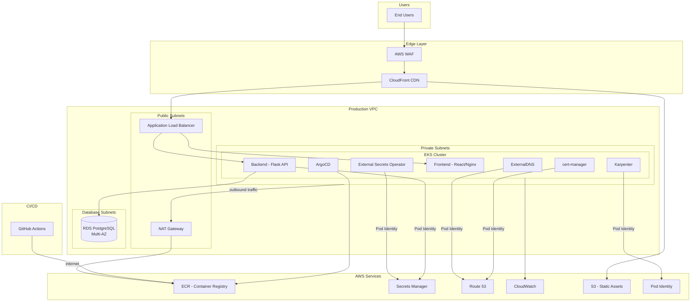
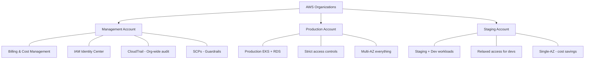
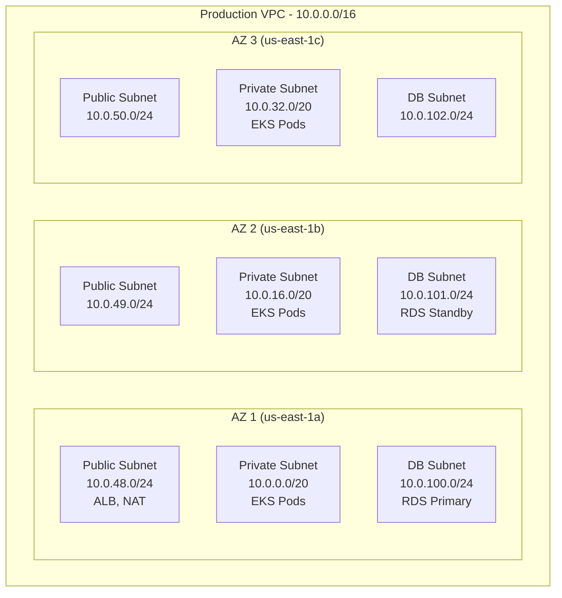
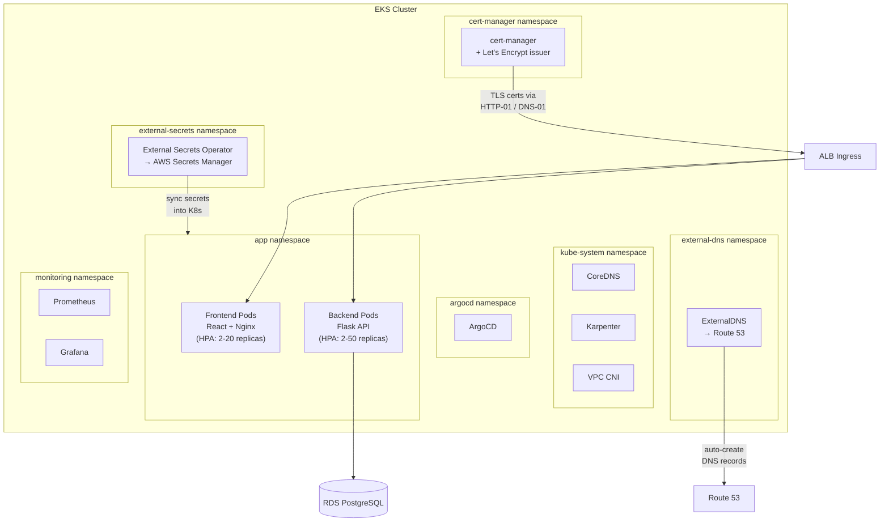
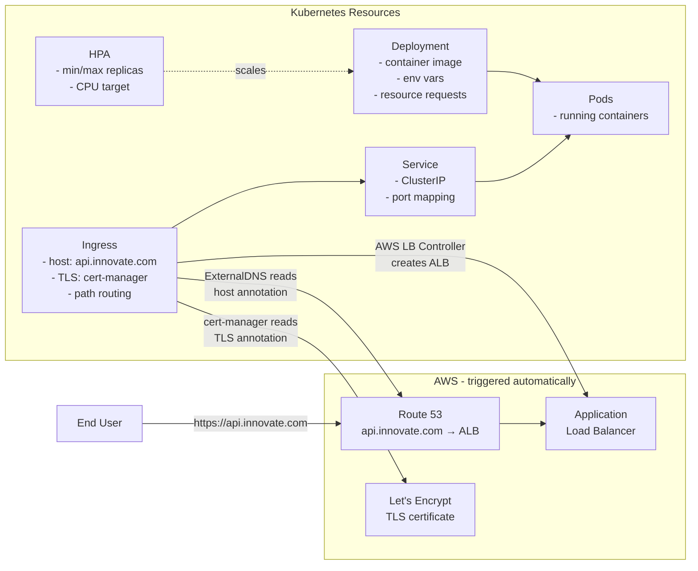
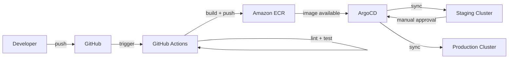

# Innovate Inc. — Cloud Architecture

Architecture design for a Flask + React + PostgreSQL web application on AWS. Built for a small startup expecting rapid growth from hundreds to millions of users.

## High-Level Architecture

**Key network flows:**

- **Inbound traffic** flows through CloudFront → WAF → ALB → EKS pods. End users never reach the private subnets directly.
- **Outbound traffic** from pods (image pulls, external API calls) goes through the NAT Gateway in the public subnet. The private subnets have no public IPs — NAT provides internet access without exposing the nodes.
- **Pod Identity** allows each Kubernetes service account to assume a specific IAM role. No static AWS credentials anywhere — ESO reads secrets, ExternalDNS manages DNS records, cert-manager validates certificates, and the backend accesses Secrets Manager, all through short-lived IAM tokens scoped to the minimum required permissions.

## Cloud Environment Structure

Three AWS accounts managed through AWS Organizations:

**Why three accounts?**

A startup doesn't need five or more accounts from day one, but running everything in a single account is a risk. The split gives you:

- **Blast radius isolation** — a misconfiguration in staging can't touch production resources. Different IAM boundaries, different VPCs, different credentials.
- **Clean billing** — you know exactly what production costs vs. staging/dev. No tagging gymnastics.
- **Security boundaries** — SCPs on the management account enforce guardrails org-wide (e.g., deny public S3 buckets, restrict regions). Production gets stricter policies than staging.

As the team grows, you can add more accounts (sandbox, data platform, security) without redesigning. AWS Organizations makes this cheap — accounts are free.

## Network Design

Each environment gets its own VPC. Here's the production layout:

**Subnet strategy:**

- **Public subnets** (`/24`, 256 IPs) — only ALBs and NAT Gateways live here. Small because very few resources need public IPs.
- **Private subnets** (`/20`, 4,096 IPs each) — EKS worker nodes and pods. Large because Karpenter provisions nodes dynamically and each pod gets a VPC IP (with the VPC CNI plugin).
- **Database subnets** (`/24`, isolated) — RDS only. No internet access, no NAT route. Only reachable from private subnets.

**Security layers:**

| Layer | What | Why |
|---|---|---|
| **WAF** | Attached to CloudFront/ALB | OWASP managed rules, rate limiting, geo-blocking |
| **Security Groups** | Per-service (ALB, EKS nodes, RDS) | Least-privilege port access — ALB→pods on 8080, pods→RDS on 5432 |
| **Network Policies** | Kubernetes-level (Calico or Cilium) | Namespace isolation — backend can reach DB, frontend cannot |
| **VPC Flow Logs** | All subnets → CloudWatch | Audit trail for network traffic, anomaly detection |
| **Private endpoints** | ECR, S3, Secrets Manager | Traffic stays on AWS backbone, never crosses the internet |

For production, the EKS API endpoint should be private-only, accessed through a VPN or bastion. For staging, public access is acceptable.

## Compute Platform

### EKS Cluster

The cluster setup follows the same pattern as the [Terraform task](../terraform/):

- **System node group** — `m7i.large` (x86, on-demand). Runs CoreDNS, kube-proxy, Karpenter, ArgoCD. Always on, fixed size (2-3 nodes).
- **Workload nodes** — managed by Karpenter. Supports both x86 and Graviton, prefers Spot instances. Karpenter right-sizes nodes based on pod requests and consolidates underutilized ones.

### Application Layout in the Cluster

**Cluster operators and what they do:**

| Operator | Namespace | Purpose | Integrates With |
|---|---|---|---|
| **Karpenter** | `kube-system` | Provisions/removes nodes based on pod demand | EC2, IAM (Pod Identity) |
| **cert-manager** | `cert-manager` | Automates TLS certificates from Let's Encrypt | Route 53 (DNS-01 validation), ALB |
| **External Secrets Operator** | `external-secrets` | Syncs secrets from AWS Secrets Manager into Kubernetes Secrets | Secrets Manager (Pod Identity) |
| **ExternalDNS** | `external-dns` | Automatically creates/updates Route 53 DNS records from Ingress/Service resources | Route 53 (Pod Identity) |
| **ArgoCD** | `argocd` | GitOps — syncs cluster state from Git | GitHub, ECR |
| **Prometheus + Grafana** | `monitoring` | Metrics collection and dashboards | CloudWatch (optional export) |

All operators that interact with AWS services use **Pod Identity** — each gets its own IAM role with least-privilege permissions. No shared credentials, no static keys.

### How an Application Becomes Accessible

Each microservice (frontend, backend) is deployed as a set of Kubernetes resources that chain together. Here's the flow from code to a live, publicly accessible endpoint:

**Step by step:**

1. **Deployment** — defines the container image, environment variables, resource requests/limits, and the desired replica count. This is what ArgoCD syncs from Git.

2. **HPA** (Horizontal Pod Autoscaler) — watches CPU/memory utilization on the pods and scales the Deployment between a min and max replica count. When HPA adds pods and there's no room, Karpenter provisions a new node.

3. **Service** (ClusterIP) — gives the pods a stable internal DNS name and load-balances traffic across them. Other services in the cluster reach the backend through `backend.app.svc.cluster.local`.

4. **Ingress** — this is where everything comes together. When you create an Ingress with:
   - `host: api.innovate.com` → **ExternalDNS** detects this and creates an A record in Route 53 pointing to the ALB
   - `tls` with a cert-manager annotation → **cert-manager** requests a TLS certificate from Let's Encrypt (validated via DNS-01 against Route 53)
   - The **AWS Load Balancer Controller** creates and configures the ALB target groups automatically

5. **End user** hits `https://api.innovate.com` → Route 53 resolves to the ALB → ALB routes to the pods via the Service → the request reaches the container.

The developer only writes the four YAML manifests (Deployment, HPA, Service, Ingress). Everything else — DNS records, TLS certificates, load balancer configuration, node provisioning — happens automatically through the cluster operators.

**Scaling:**

- **HPA** scales pods horizontally based on CPU utilization and request rate.
- **Karpenter** provisions/removes nodes as HPA scales pods up/down. No cluster-autoscaler needed.
- Resource `requests` and `limits` on all pods to enable proper bin-packing and prevent noisy neighbors.

### Containerization & CI/CD

**Image workflow:**

1. Developers push to GitHub
2. GitHub Actions runs: lint → test → build Docker image → push to ECR
3. Image tagged with commit SHA (immutable, traceable)
4. ArgoCD detects the new image and syncs to the cluster

**Environment promotion:**

- Merge to `main` → auto-deploy to **staging**
- Tag a release → deploy to **production** after manual approval in ArgoCD

**Why ArgoCD?**

Terraform provisions infrastructure. ArgoCD manages what runs on the cluster — deployments, services, Karpenter NodePools, config. This separation means developers can change application config (replicas, env vars, resource limits) through a Git PR without touching Terraform. ArgoCD also gives you drift detection, rollback, and a clear audit trail of what's deployed.

### Frontend Serving

Two options depending on the growth stage:

- **Early stage**: React built into a Nginx container, deployed as pods in EKS. Simple, everything in one place.
- **At scale**: Static assets in S3, served through CloudFront. Lower cost, global CDN, no compute needed for static files. The Flask API stays in EKS behind the ALB.

Start with Nginx pods and move to S3 + CloudFront when traffic justifies it.

## Database

### Amazon RDS for PostgreSQL

**Why RDS and not Aurora?**

Aurora is more capable, but RDS for PostgreSQL is the right choice for a startup:

- **Cost** — Aurora has a higher baseline cost. RDS `db.t4g.medium` is enough for the initial load and costs a fraction of Aurora.
- **Simplicity** — standard PostgreSQL, no Aurora-specific behaviors to learn.
- **Upgrade path** — when traffic hits the point where Aurora's read scaling and faster failover matter, migration from RDS PostgreSQL to Aurora PostgreSQL is straightforward (snapshot and restore).

### Configuration

| Setting | Production | Staging |
|---|---|---|
| Instance | `db.r7g.large` (Graviton) | `db.t4g.medium` |
| Multi-AZ | Yes (automatic failover) | No |
| Storage | gp3, 100GB, autoscaling | gp3, 20GB |
| Encryption | KMS at rest + TLS in transit | Same |
| Public access | No | No |

### Backups & Disaster Recovery

- **Automated snapshots** — daily, 35-day retention. Point-in-time recovery with 5-minute granularity.
- **Cross-region snapshots** — replicate to a secondary region for disaster recovery.
- **Read replicas** — add when read traffic grows. Can also serve as a fast failover target.
- **RTO/RPO** — Multi-AZ failover takes ~60 seconds (RTO). RPO is near-zero with synchronous replication to the standby.

### Credential Management

Database credentials stored in **AWS Secrets Manager** with automatic rotation. EKS pods access them via Pod Identity — no credentials in environment variables or config files.

## Security Summary

| Area | Approach |
|---|---|
| **Identity** | IAM Identity Center (SSO) for humans, Pod Identity for services |
| **Secrets** | Secrets Manager with automatic rotation |
| **Encryption at rest** | KMS — RDS, EBS volumes, S3, ECR |
| **Encryption in transit** | TLS everywhere — ALB, pod-to-pod (service mesh optional), pod-to-RDS |
| **Edge protection** | CloudFront + WAF + AWS Shield Standard |
| **Threat detection** | GuardDuty across all accounts |
| **Audit** | CloudTrail (org-wide), VPC Flow Logs, EKS audit logs |
| **Container security** | ECR image scanning, read-only root filesystems, non-root containers |
| **Network** | Security groups + K8s network policies, private subnets, no public DB access |

## Cost Optimization

A startup needs to be smart about cost from day one:

- **Karpenter + Spot + Graviton** — workload nodes use Spot instances (60-90% cheaper) with Graviton where possible. Karpenter consolidates underutilized nodes automatically.
- **Right-sized RDS** — start with `db.t4g.medium`, scale vertically when needed. No over-provisioning.
- **Single NAT gateway** — one per VPC for the POC. Add one per AZ when uptime SLAs require it.
- **S3 + CloudFront** for frontend at scale — cheaper than running Nginx pods for static content.
- **Reserved Instances / Savings Plans** — commit to 1-year plans for system nodes and RDS once traffic patterns stabilize.
- **Staging on Single-AZ** — no multi-AZ overhead for non-production.

## Growth Path

How the architecture evolves from hundreds to millions of users:

| Phase | Users | What Changes |
|---|---|---|
| **Launch** | Hundreds/day | Current setup. Small EKS, single RDS, Spot nodes. |
| **Traction** | Thousands/day | HPA scales pods, Karpenter adds nodes. Add RDS read replica. Move frontend to S3+CloudFront. |
| **Scale** | Hundreds of thousands/day | Migrate to Aurora PostgreSQL. Add ElastiCache (Redis) for session/cache. Multiple AZ NAT gateways. Consider service mesh. |
| **Mass scale** | Millions/day | Multi-region with Aurora Global Database. CloudFront at edge. Dedicated AWS accounts per team. Event-driven architecture (SQS/SNS) for async workloads. |

The architecture is designed so that each phase is an incremental change, not a rewrite. Karpenter, HPA, and managed services handle most of the scaling automatically.
